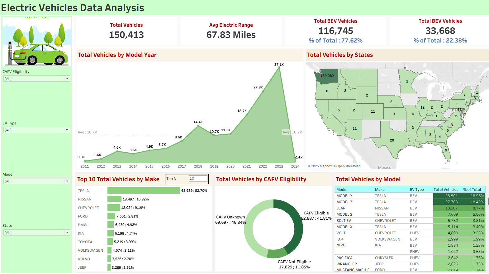

# Electric Car Population Dashboard 

This project was created for the purpose of learning how to build an insightful data dashboard using Tableau. The primary goal was to practice data visualization techniques and uncover insights from the provided dataset.

This repository contains the Tableau workbook and related files for a practice project focused on analyzing the electric car population. It demonstrates the process of transforming raw data into an interactive and meaningful dashboard.

## 📊 Dashboard Preview
 

## 🗃️ Data Source
The dataset used for this analysis was provided by Data Tutorials and can be accessed via the following link:

Dataset: [Electric Vehicle Population Data on Google Drive](https://drive.google.com/drive/folders/1YviyK5J_0LS9yBb2lNh2Fyap1xlyec7W)

## 🎓 Tutorial & Reference
This entire project was inspired by and created following an excellent tutorial. The original video provides a complete step-by-step guide on how to build this dashboard from scratch.

Tutorial: Tableau Project | Dashboard Practice For Beginners by Data Tutorials https://www.youtube.com/watch?v=Y22CBLeHffg

## 🙏 Acknowledgements
A special thank you to [Data Tutorials](https://www.youtube.com/@datatutorials1) for creating and sharing such a helpful and instructive guide. Their content was invaluable for learning and completing this project.

